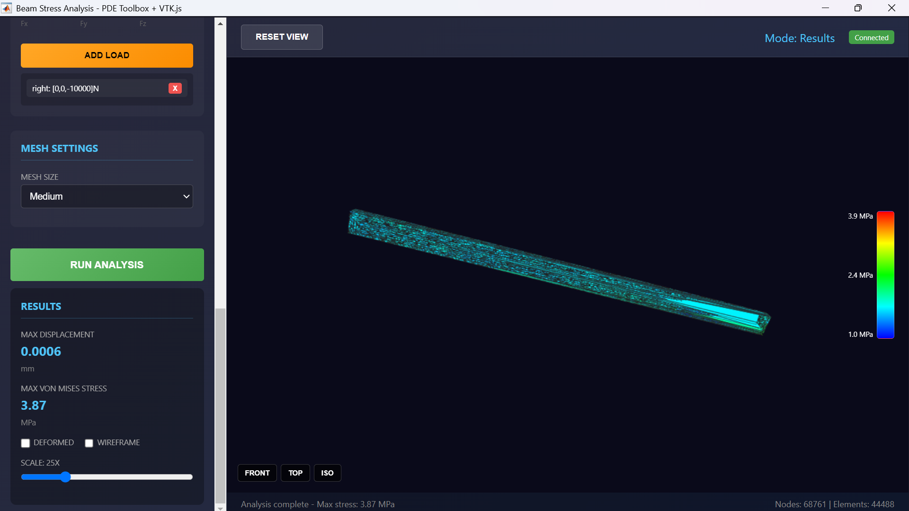

# Beam Stress Analysis App

Interactive mechanical beam stress/strain analysis application using MATLAB PDE Toolbox with a web-based UI.


<!-- TODO: Add screenshot showing the app with analysis results -->

## Overview

This application provides a no-code, point-and-click interface for performing structural finite element analysis on rectangular beams. It combines:

- **MATLAB PDE Toolbox** - For meshing and solving structural mechanics problems
- **HTML/JavaScript UI** - Interactive 3D visualization with Canvas 2D rendering
- **uihtml Component** - Bridge between web interface and MATLAB backend

## Features

### Geometry Definition
- Set beam dimensions (length, width, height) in meters
- Real-time 3D preview with interactive rotation and zoom

### Material Properties
- Pre-configured material presets: Steel, Aluminum, Copper, Titanium
- Custom Young's Modulus and Poisson's Ratio input

### Boundary Conditions
- Apply fixed or roller constraints to beam faces
- Visual indicators show constraint locations

### Applied Loads
- Distributed surface loads on any face
- Specify force components (Fx, Fy, Fz) in Newtons

### Analysis & Results
- Automatic tetrahedral mesh generation (coarse/medium/fine)
- von Mises stress calculation and visualization
- Displacement magnitude with deformation scaling
- Color-mapped stress contours with interactive colorbar

### Visualization Controls
- Mouse drag to rotate view
- Scroll wheel to zoom
- Preset views: Front, Top, Isometric
- Toggle wireframe mode
- Adjustable deformation scale (1x - 100x)

## Requirements

- MATLAB R2020a or later
- Partial Differential Equation Toolbox

## Installation

1. Clone or download this repository
2. Navigate to the `BeamStressAnalysis` folder in MATLAB
3. Run the application:

```matlab
beamStressAnalysis()
```

## Usage

### Quick Start Example: Cantilever Beam

1. **Create Beam**: Use default dimensions (1m x 0.1m x 0.05m) and click "Create Beam"
2. **Add Constraint**: Select "Left Face" + "Fixed", click "Add Constraint"
3. **Add Load**: Keep "Right Face" selected, set Fz = -10000 N, click "Add Load"
4. **Run Analysis**: Click the green "Run Analysis" button
5. **View Results**: Examine stress distribution, adjust deformation scale

### Typical Workflow

```
┌─────────────────┐     ┌─────────────────┐     ┌─────────────────┐
│  Define Beam    │ ──▶ │  Set Material   │ ──▶ │  Add Boundary   │
│  Geometry       │     │  Properties     │     │  Conditions     │
└─────────────────┘     └─────────────────┘     └─────────────────┘
                                                        │
                                                        ▼
┌─────────────────┐     ┌─────────────────┐     ┌─────────────────┐
│  View Results   │ ◀── │  Run Analysis   │ ◀── │  Apply Loads    │
│  & Export       │     │                 │     │                 │
└─────────────────┘     └─────────────────┘     └─────────────────┘
```

## File Structure

```
BeamStressAnalysis/
├── beamStressAnalysis.m    # Main MATLAB application
├── beamAnalysis.html       # Web-based UI (HTML/CSS/JavaScript)
├── README.md               # This file
└── screenshot.png          # Application screenshot (placeholder)
```

## Technical Details

### PDE Toolbox Workflow

1. **Geometry**: Creates 3D beam using `multicuboid()`
2. **Material**: Assigns Young's modulus, Poisson's ratio, density
3. **Boundary Conditions**: Applies constraints using `faceBC()`
4. **Loads**: Applies surface tractions using `faceLoad()`
5. **Mesh**: Generates tetrahedral mesh with `generateMesh()`
6. **Solve**: Computes displacements and stresses with `solve()`

### Data Transfer

Results are transferred from MATLAB to JavaScript as flattened arrays:
- Node coordinates (x, y, z interleaved)
- Displacement values (ux, uy, uz interleaved)
- Stress values (per node, interpolated from elements)
- Boundary triangles (for surface rendering)

### 3D Rendering

The visualization uses pure JavaScript Canvas 2D with:
- Perspective projection
- Depth-sorted triangle rendering
- Color mapping for stress visualization
- Interactive camera controls

## Limitations

- Beam geometry only (rectangular prisms)
- Linear elastic material behavior
- Static analysis only (no dynamics)
- Surface loads only (no point loads or body forces)

## Troubleshooting

**App doesn't start**: Ensure you're in the correct directory containing both `.m` and `.html` files.

**Analysis fails**: Check that at least one boundary condition and one load are defined.

**Slow mesh generation**: Use "Coarse" mesh setting for faster results during initial setup.

## License

This project is provided as-is for educational and demonstration purposes.

## Acknowledgments

- MATLAB PDE Toolbox documentation and examples
- Anthropic Claude for development assistance
